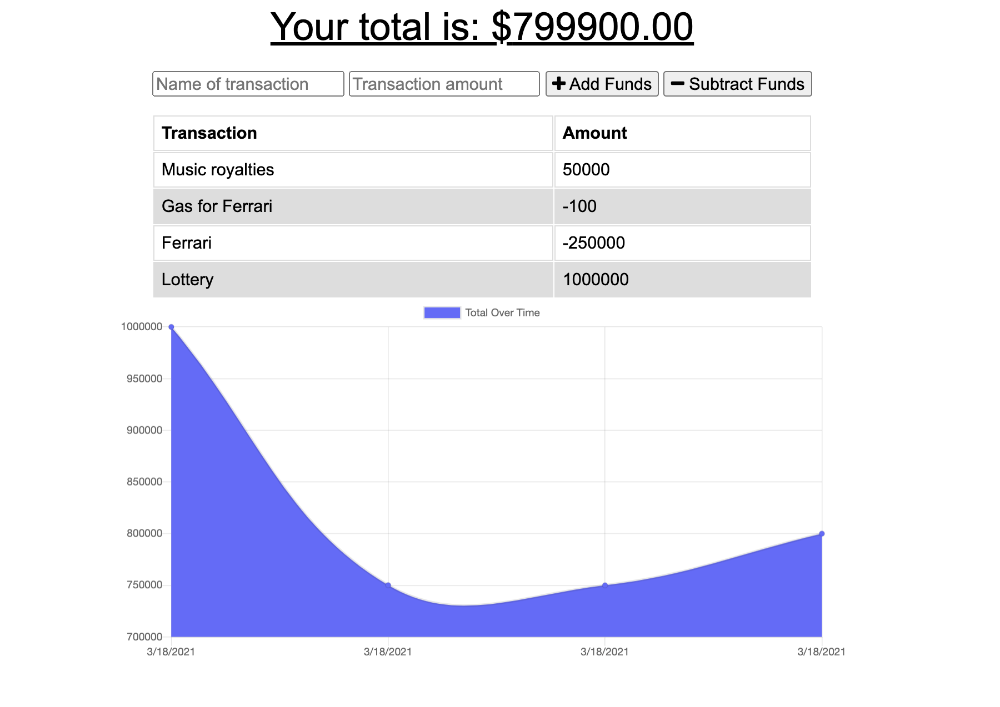

# budget-tracker

## Description

This is a homework assignment for the University of Denver Web Development Boot Camp!  

For this project, I was to convert a budget tracking app to be a progressive web app. The budget tracker app is a full-stack app that allows a user to enter debits and credits to their budget, and graphs them accordingly. The transactions entered by the user are stored using MongoDB. The PWA functionality I added includes using IndexedDB to allow the user to continue to post transactions even when their internet connection is offline, and once back online, those transactions will be added to the main MongoDB database. 

## Deployment

The code (and associated assets) are hosted right here in this GitHub repository, and it's all live on the web thanks to Heroku. If you would like to check it out, you can view the site at the link below:

<a href="https://stormy-garden-25212.herokuapp.com/" target="_blank"><b>budget-tracker Live App</b></a>
  

## Credits

This project was made using HTML, CSS, Javascript, Node.js, Express.js, and MongoDB.
